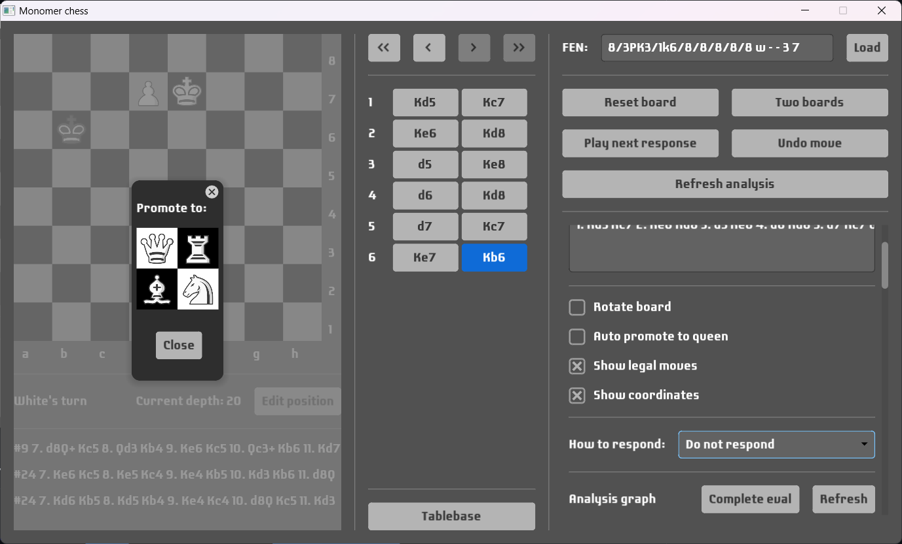

# Monomer chess

## Goals
- To have a chess GUI written in Haskell.
- To learn [Minimax](https://en.wikipedia.org/wiki/Minimax) (with [alpha-beta pruning](https://en.wikipedia.org/wiki/Alpha%E2%80%93beta_pruning)) and [MCTS](https://en.wikipedia.org/wiki/Monte_Carlo_tree_search) algorithms.

## Features
- Shows moves history in [algebraic notation](https://en.wikipedia.org/wiki/Algebraic_notation_(chess)).
- Supports [PGN](https://en.wikipedia.org/wiki/Portable_Game_Notation) and allows to import game.
- Shows [FEN](https://en.wikipedia.org/wiki/Forsyth%E2%80%93Edwards_Notation) of the current position and allows to load other FEN.
- Board can be rotated to view the position from either color's perspective.
- It is possible to undo moves.
- It is possible to play against computer and choose how it would
calculate its response to your move:
    - **Random**: chooses randomly from all possible moves.
    - **Minimax**: basic implementation with alpha-beta pruning and configurable depth, shows its evaluation (no [quiescence search](https://en.wikipedia.org/wiki/Quiescence_search) and other stuff implemented so evaluation is not accurate).
    - **MCTS**: Monte Carlo tree search with configurable number of runs, rollouts played randomly to the end of the game.
    - **UCI**: Use external engine (like Stockfish) to play against it.

- It possible to edit current position on the board (including whose turn it is now and castling rights):

- Nice dialog window when a pawn promotes:

- Support two boards (from both colors' perspective):

- Tablebase using Lichess API:

- Support external UCI engine:

- Build analysis graph using UCI engines (you can load multiple engines so they analyse simultaneously to speed up the process):

## License
- This project is licensed under the [MIT license](LICENSE).
- This project uses [Laconic](https://www.fontsquirrel.com/fonts/laconic) font, licensed under the [SIL Open Font License](https://www.fontsquirrel.com/license/laconic).
- This project uses fresca chess pieces by sadsnake1, licensed under the [CC BY-NC-SA 4.0](https://creativecommons.org/licenses/by-nc-sa/4.0/).

## Acknowledgements
- Thanks to [Francisco Vallarino](https://github.com/fjvallarino) for [Monomer](https://github.com/fjvallarino/monomer) GUI library.
- Thanks to [Mario Lang](https://github.com/mlang) for [chessIO](https://github.com/mlang/chessIO) library.
